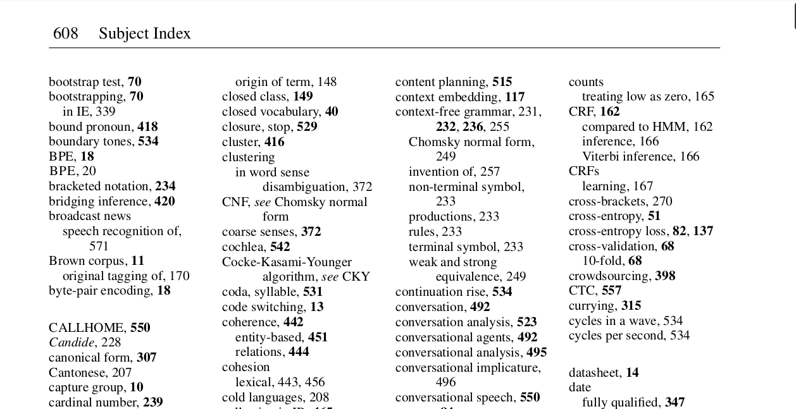

## В предыдущей серии

1. Рассматриваем поиск по текстовой *коллекции*.
2. Коллекция состоит из *документов*.
3. Документ состоит из *терм(ин)ов*.
4. Пользователь имеет *информационную потребность* и задает *запросы*.
5. То, насколько документ подходит к запросу, &mdash; *релевантность*.

## Как же сделать поиск?

Самый простой вариант (`grep`):

+ получаем запрос,
+ просматриваем всю коллекцию,
+ выбираем подходящие документы

. . .

+ Чем это плохо?
+ Чем это хорошо?
+ Что делать, если в запросе >1 термина?

## Идея

{width=80%} \

## Индекс

| словарь | словопозиции |
| -- | -- 
| чебоксары | 7, 290 |
| чебурашка | 62, 290, 304 |
| чебурек | 14, 17, 155 |
| чемодан | 2, 9, 14, 75, 76, 84, 90, 102, ... |

. . .

+ список словопозиций тж. наз. *постинг* или кишка
+ словарь отсортирован (зачем?)
+ всё вместе &mdash; **обратный** или **инвертированный индекс** (или&nbsp;просто индекс)

## Минутка этимологии

\Large \center

Yandex = \textcolor{red}{Y}et \textcolor{red}{A}nother I\textcolor{red}{ndex}er

## Булев поиск

- (boolean retrieval)
+ если термин встретился в документе, то документ релевантен
+ иначе нерелевантен (бинарная релевантность)
+ что делать, если в запросе >1 термина?
+ в этой модели запросы должны выглядеть иначе:
	+ `[компьютерный AND лингвистика]`
	+ `[лингвистика OR языкознание]`
	+ `[прикладной AND (лингвистика OR языкознание)]`
	+ `[морфология AND NOT клетка]`

## Булев поиск (алгоритм)

1. Разбираем запрос на термины и операторы
2. Определяем порядок выполнения запроса
3. Достаем из индекса постинг для каждого термина
4. Пересекаем/объединяем постинги
	+ если они отсортированы, пересечение можно сделать за один проход: $O(N+M)$

## Пересечение списков

$\colorbox{green}1 \rightarrow \colorbox{green}3 \rightarrow 4 \rightarrow 7$

$\colorbox{green}1 \rightarrow 2 \rightarrow \colorbox{green}3 \rightarrow 5$

\vfill

$1 \rightarrow 3$

## Общая схема

<!--
	crowling{{Краулинг}}
	collection[(Коллекция)]
	indexing{{Индексация}}
	index[(Индекс)]
	search{{Поиск}}
	query[Запрос]
	serp[Выдача]
-->
``` {.dot height="75%"}
digraph scheme {
	rankdir="LR";
	crowling -> collection
	collection -> indexer
	indexer -> index [label="индексация"]
	query -> search
	search -> serp
	search -> index
	index -> search

	crowling [label="Краулинг", shape="hexagon"]
	collection [label="Коллекция", shape="cylinder"]
	indexer [label="Индексатор", shape="diamond"];
	index [label="Индекс", shape="cylinder", fillcolor="orange", style=filled]
	search [label="Поиск", shape="hexagon"]
	query [label="Запрос", shape="rectangle"]
	serp [label="Выдача", shape="rectangle"]
}
```

## Оптимизация

`[ремонт AND газового AND водонагревателя]`

. . .

+ предположим, термины встречаются с такой частотой:
	+ `ремонт`: 15000 документов
	+ `газовый`: 2500 документов
	+ `водонагреватель`: 20 документов
+ сколько в худшем случае операций требует пересечение?
	+ $(15000 + 2500) + min(15000, 2500) + 20 = 20020$
+ можно ли улучшить?
	+ `[водонагревателя AND газового AND ремонт]`
	+ $(2500 + 20) + min(2500, 20) + 15000 = 17540$

## Проблемы 1

`[ремонт электронных часов casio]`

. . .

Получаются одинаково нерелевантны документы:

+ "ремонт электронных часов"
+ "ремонт наручных часов casio"
+ "ремонт мебели"
+ ...

. . .

Обычно хотим не так радикально.

## Проблемы 2

`[московский кремль]`

. . .

Получаются одинаково релевантны документы:

+ "**московский кремль** построен в конце XV века"
+ "экспозиция &laquo;псковский **кремль**&raquo; по адресу: **московский** проспект..."

. . .

Это проблема модели мешка слов (*bag-of-words*).

## Проблемы 3

Некоторые термы слишком часто встречаются и:

+ занимают много места в индексе
+ тратим на них много времени при пересечении/объединении
+ как правило, выполняют грамматическую функцию
+ не добавляют смысла ни в документ, ни в запрос

## Проблемы 3

Простое решение:

- объявляем такие термы **стоп-словами**
+ выбрасываем из индекса
+ выбрасываем из запросов

. . .

Но теперь есть другие проблемы:

+ поиск по точной цитате: [песня я и ты], [быть или не быть]
+ неоднозначность этих форм:
	+ [история 19&nbsp;*в*]
	+ [*по* для обработки видео]

## Проблемы

- если ищем через AND &mdash; слишком мало результатов
	+ высокая точность, низкая полнота
+ если ищем через OR &mdash; слишком много результатов
	+ низкая точность, высокая полнота
+ не учитывается частота термина
+ хотим более тонкую настройку &mdash; **ранжирование**
+ в текущем виде это скорее *фильтрация*

## Проблемы 4

Требуется квалифицированный пользователь:

+ тщательно формулирует поисковый запрос
+ способен задавать запросы вида `(A AND B) OR C`
+ готов просмотреть все найденные документы
+ хорошо представляет себе коллекцию

## Резюме

1. Не можем просматривать всю коллекцию на каждый запрос.
2. *Инвертированный индекс* задает соответствие термин&nbsp;$\rightarrow$&nbsp;документ.
3. Такой индекс требует запросов специального вида (термины + *операторы*).
4. Всё вместе это *булев поиск*, имеет целый ряд проблем.
