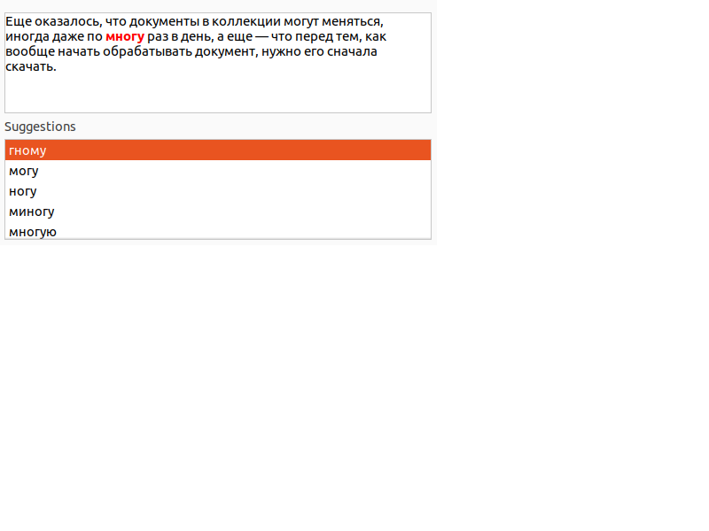

## Примеры

~**10–15%** запросов содержат ошибки/опечатки.

- `[однаклассники]`
- `[однокласники]`
- `[однолассники]`
- `[jlyjrkfcybrb]`
- `[одноклас]`
- `[одно классники]`
- `[аднакласни]`

## Типы ошибок

1. Орфография
	+ `[скочать ...]`, `[скчать ...]`, `[скаачать ...]`, `[скачтаь ...]`
1. Пробелы
	+ `[арендагазели]`, `[анти статик]`
2. Раскладка/транслит (не всегда ошибки)
	+ `[мл]`,
	+ `[спбу ру]`,
	+ `[macbuk kak pereklychit yazik]`
1. Смешанные
	+ `[vr,erghj]` -> `[мкбукпро]` -> `[макбук про]`

## Типы ошибок

5. Непонятные
	+ `[пагода в пекине]`
	+ `[rfcnh.kz]` — домен или кастрюля?
	+ `[CNJK 2V]` — стол или модель чего-то?
	+ `[клон]` vs `[африканский клон]`

## Ключевые вопросы

1. Есть ли в запросе опечатки и где именно?
2. Как должен выглядеть исправленный запрос?
3. Что мы делаем с опечатками?

## Стратегии

В зависимости от нашей уверенности в исправлении:

1. Автоисправление
2. Подсказка
	+ «возможно, вы искали…»
	+ мы ограничены в количестве
1. Смешивание
	+ требует обработки двух запросов!
	+ по результатам поиска можем заменить на автоисправление

## Первый подход

1. Ищем слово в словаре
1. Если не нашлось, то это опечатка
	+ словарь нужно все время актуализировать
1. Ищем ближайшее* слово для замены
	+ или несколько

## Первый подход: проблемы

::: columns

:::: {.column width="70%"}

- нормально работает в текстовых редакторах, но:
- не можем давать выбор из множества вариантов
- словарь всегда неполон
	- как вообще составить словарь?
- опечатка может быть существующим словом (*real-word spelling error*)
	- `[всемирный потом]`
	- мешает «умная» клавиатура в мобильных устройствах

::::

:::: {.column width="30%"}

{width=150%} \

::::

:::

## Поиск ближайшего слова

Ключевое понятие: **расстояние Левенштейна** \
(тж. расстояние редактирования, *edit distance*)

. . .

Идея: посчитаем, сколько операций нужно сделать для превращения одного слова в другое

## Расстояние Левенштейна

```{=latex}
\begin{tabular}{|*{10}{c|}}
\hline
      & Я & Н & \textbf{В} & \textbf{А} & Р & \textbf{Ь} \\
    \hline
    \cellcolor{green}{К} & \cellcolor{yellow}{Р} & \cellcolor{yellow}{О} & \textbf{В} & \textbf{А} & \cellcolor{yellow}{Т} & \textbf{Ь} \\
\hline
\end{tabular}
```

. . .

$d_L(\text{январь}, \text{кровать}) = 4$

. . .

\vfill

```{=latex}
\begin{tabular}{|*{8}{c|}}
\hline
     Х & О & Р & \textbf{В} & \textbf{А} & \textbf{Т} & И & \cellcolor{pink}{Я} \\
    \hline
    \cellcolor{yellow}{К} & \cellcolor{yellow}{Р} & \cellcolor{yellow}{О} & \textbf{В} & \textbf{А} & \textbf{Т} & \cellcolor{yellow}{Ь} & \\
\hline
\end{tabular}
```

. . .

$d_L(\text{хорватия}, \text{кровать}) = 5$


## Расстояние Дамерау-Левенштейна

```{=latex}
\begin{tabular}{|*{8}{c|}}
\hline
     Х & \cellcolor{cyan}О & \cellcolor{cyan}Р & \textbf{В} & \textbf{А} & \textbf{Т} & И & \cellcolor{pink}{Я} \\
    \hline
    \cellcolor{yellow}{К} & \cellcolor{cyan}{Р} & \cellcolor{cyan}{О} & \textbf{В} & \textbf{А} & \textbf{Т} & \cellcolor{yellow}{Ь} & \\
\hline
\end{tabular}
```

. . .

$d_{DL}(\text{хорватия}, \text{кровать}) = 4$

\vfill

1. \colorbox{green}{вставка}
2. \colorbox{pink}{удаление}
3. \colorbox{yellow}{замена}
4. **\textcolor{cyan}{перестановка}**

## Ещё о расстоянии редактирования

- веса разных операций имеет смысл делать разными
	+ например, учитывать расстояние на клавиатуре
	+ или статистику из логов запросов
+ можно добавлять свои операции
	+ например, «смена раскладки»
+ как выбрать между несколькими словами с&nbsp;одинаковым&nbsp;$d_L$?
	+ `[тстер] -> {тестер, тостер}`
	+ `[белеты] -> {`**`билеты`**`, береты, белены, ...}`
		+ может помочь частота 
+ можно ли учесть контекст?
	+ `[белеты до омска]`

## Переход к вероятности

$fix^* = \mathop{argmax}\limits_{fix \in D} (P(fix \mid orig))$,

где

+ $orig$ — запрос, который исправляем
+ $fix^*$ — искомое исправление
+ $D$ — множество всех возможных запросов
+ возможно, $orig = fix$

## Модели

$P(fix \mid orig) = {P(orig \mid fix) \times P(fix) \over P(orig)}$

+ (это формула Байеса)
+ $P(orig \mid fix)$ — из модели ошибок
	+ какова вероятность, что пользователь набирал $fix$, а получилось $orig$?
+ $P(orig)$, $P(fix)$ — из модели языка
	+ какова вероятность, что это «настоящее» слово?
+ в целом это модель зашумленного канала (*noisy channel model*), тж. используется в классическом машинном переводе

## Модели

1. Модель ошибок
	+ разумно связать с близостью слов
	+ например: $P(orig \mid fix) = \alpha^{-d_L(orig, fix)}$
	+ можно упростить до вероятностей на N-граммах
	+ можно усложнять пользовательской статистикой и&nbsp;т.д.
2. Модель языка
	+ скорее генеративная модель, чем словарь
	+ $P(w_1\dots w_n) = P(w_1 w_2)P(w_2 w_3)\dots P(w_n)$
		+ скорее всего, нужно сглаживание
	+ нужно регулярно обновлять

## Что дальше

+ проблема: для $argmax$ нужно перебрать все потенциально возможные замены и посчитать вероятность каждой (нереально)
+ значит, нужна генерация кандидатов в исправления, скорее всего —&nbsp;пословно
+ значит, нужен некий индекс или другая структура, возвращающая множество слов, *более или менее похожих* на&nbsp;данное
+ это называется нечеткий поиск (*approximate string matching*, *fuzzy search*)

## Soundex/Metaphone

+ алгоритмы для сопоставления слову цифро-буквенного кода
	+ Soundex — изначально для имен/фамилий
+ идея: похожие на слух слова получат одинаковые коды
	+ можно считать хэшированием (*phonetic hash*)
+ можно создать индекс, где ключом будет фонетический&nbsp;код
+ работает только для отдельных типов опечаток

## Soundex: алгоритм

| **буква** | **переходит в** |
| -- | -- |
| a, e, i, o, u, y, h, w | 0 |
| b, f, p, v | 1 |
| c, g, j, k, q, s, x, z | 2 |
| d, t | 3 |
| l | 4 |
| m, n | 5 |
| r | 6 |

## Soundex: примеры

| **слово** | **код** |
| -- | -- |
| Jane | J500 |
| Johann| J500 |
| Jake | J200 |
| Yoan | Y500 |
| Robert | R163 |
| Rupert | R163 |

## Trie (префиксное дерево, бор)

``` {.dot height="75%"}
digraph trie {
	rankdir="LR";
	Б -> И
	Б -> А
	Б -> Е
	И -> Л
	А -> Л
	Л -> Е2
	Е2 -> Т
	Е -> Л2
	Л2 -> Я
	Я -> Ш
	А -> Г
	Г -> Е2

	Е2 [label = "Е"]
	Л2 [label = "Л"]
	Г [style=filled, fillcolor=yellow]
	Т [style=filled, fillcolor=yellow]
	Ш [style=filled, fillcolor=yellow]
}
```

баг, багет, балет, билет, беляш

## Trie: пример

``` {.dot height="75%"}
digraph trie {
	rankdir="LR";
     node [fixedsize=true];
	Б -> И
	Б -> А
	Б -> Е
	И -> Л
	А -> Л
	Л -> Е2
	Е2 -> Т
	Е -> Л2
	Л2 -> Я
	Я -> Ш
	А -> Г
	Г -> Е2

	Е2 [label = "Е"]
	Л2 [label = "Л"]
	Г [style=filled, fillcolor=yellow]
	Т [style=filled, fillcolor=yellow]
	Ш [style=filled, fillcolor=yellow]
	Б [label=<Б<br/>1.0>, color=red]
}
```

\textcolor{red}{Б}ЕЛЕТ

## Trie: пример

``` {.dot height="75%"}
digraph trie {
	rankdir="LR";
     node [fixedsize=true];
	Б -> И [label="И~Е 0.8"];
	Б -> А [label="А~Е 0.5"]
	Б -> Е [label="Е~Е 1.0"]
	И -> Л
	А -> Л
	Л -> Е2
	Е2 -> Т
	Е -> Л2
	Л2 -> Я
	Я -> Ш
	А -> Г
	Г -> Е2

	Е2 [label = "Е"]
	Л2 [label = "Л"]
	Г [style=filled, fillcolor=yellow]
	Т [style=filled, fillcolor=yellow]
	Ш [style=filled, fillcolor=yellow]
	Б [label=<Б<br/>1.0>]
	И [label=<И<br/>0.8>, color=red]
	А [label=<А<br/>0.5>, color=red]
	Е [label=<Е<br/>1.0>, color=red]
}
```

Б\textcolor{red}ЕЛЕТ

## Trie: пример

``` {.dot height="75%"}
digraph trie {
	rankdir="LR";
     node [fixedsize=true];
	Б -> И
	Б -> А
	Б -> Е
	И -> Л [label="Л~Л 1.0"]
	А -> Л [label="Л~Л 1.0"]
	Л -> Е2
	Е2 -> Т
	Е -> Л2 [label="Л~Л 1.0"]
	Л2 -> Я
	Я -> Ш
	А -> Г [label="Г~Л 0.3"]
	Г -> Е2

	Е2 [label = "Е"]
	Л [label = <Л<br/>0.8|0.5>, color=red]
	Л2 [label = <Л<br/>1.0>, color=red]
	Л [color=red]
	Г [style=filled, fillcolor=yellow, color=red, label=<Г<br/>0.15>]
	Т [style=filled, fillcolor=yellow]
	Ш [style=filled, fillcolor=yellow]
	Б [label=<Б<br/>1.0>]
	И [label=<И<br/>0.8>]
	А [label=<А<br/>0.5>]
	Е [label=<Е<br/>1.0>]
}
```

БЕ\textcolor{red}ЛЕТ